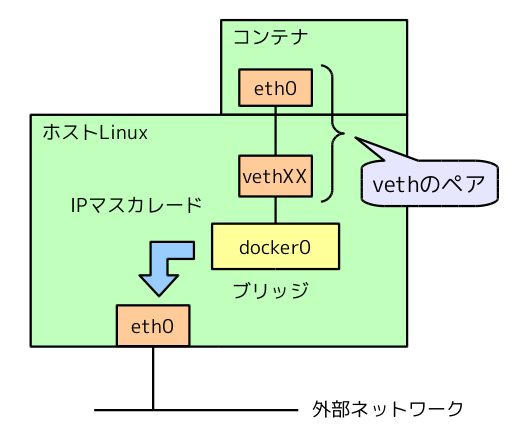

ホスト上ではコンテナ向けにvethペアが作成され、片方はdocker0ブリッジ、もう片方にはコンテナが接続されます。




コンテナが接続されているvethのペアはnetwork namespaceを利用して隔離されているためホスト側から確認することはできません。(本環境では実行することができませんが、ip netnsコマンドを利用するとホスト側からコンテナのネットワーク・インターフェースを確認することは可能です。)

```execute
ip link show
```

```execute
ip address
```

docker0がブリッジとして存在しており、コンテナ向けのvethがdocker0ブリッジに接続されています。

```execute
brctl show
```

```execute
ip link show master docker0
```

コンテナはdocker0ブリッジに接続され、外部から接続できなIPアドレスが割り当てられるため、Webサーバーのような外部に公開したいコンテナの場合は、外部に公開するポートを指定する事が可能です。nginxコンテナを8080番ポートで接続できるように公開してみます。

```execute
docker run -itd --name nginx1 -p 8080:80 quay.io/mnara/nginx
```

起動したコンテナを確認すると、コンテナの80番ポートがホストの8080番ポートにマッピングされています。ハンズオンターミナル上部のport 8080タブを開くと、8080ポートにアクセスしてnginxが起動したことを確認することができます。
[ここ]({{ ingress_protocol }}://{{ session_namespace }}-access1.{{ ingress_domain }})からも確認することが可能です。
